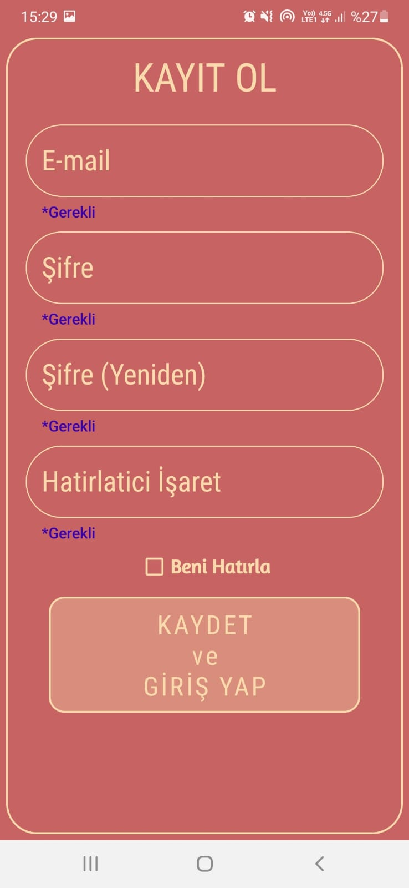

# MovieMarket

### Proje Bilgileri
- Projede, üye değilsen üye olarak ya da misafir giriş için 1 adet giriş hakkı ile giriş yapabiliriz.

- Şifremi unuttum ve beni hatırla bulunmaktadır. Şifreyi, kayıt olurken belirlenen hatırlatıcı işaret ile sıfırlayıp, yeni şifre oluşturabiliriz.

- Giriş yaparken Splash Screen ile kısa bir animasyon oynatılmıştır.

- Film CardView e tıklayarak film hakkında detaylı bilgiye ulaşabiliriz.

- RecylerView'deki Her kart CardView üzerinde filmin fotoğrafı, ismi,fiyatı ve sepete ekle butonu bulunmaktadır.

- Her ürün için sepete ekle tıklandığında sepete ekler ve animasyon ileeklendiği anlatılır, sağ üstte sepete tıklayarak sepet detayı görebiliriz.

- Sepette, toplam sepet tutarı, film adı-fiyatı-adeti-adet fiyatı-adeti artırıp azaltma butonu ve sepetin hepsini silmek için belirten animasyon bulunmaktadır.

- Sepette hepsini sil tıklandığında, onay isteyip verirsek sepeti boşaltarak boş olduğunu gösterir bir animasyon bulunmaktadır.

------------

####  Kullanılan yapılar
- RecyclerView-CardView
- BottomSheet
- Splash Screen
- Lottie Files Animasyonu
- SQLite database.

------------
#### Ekran Görüntüleri
  
<table>
  <tr>
    <td>Açılış Ekranı-Splash Screen.</td>
     <td>Giriş Sayfası.</td>
     <td>Kayıt Ol Ekranı.</td>
     <td>Misafir Giriş- 1 adet giriş hakkı var.</td>

  </tr>
  <tr>
    <td></td>
    <td></td>
    <td></td>
      <td></td>
  </tr>
 </table>
 
  

<table>
  <tr>
    <td>Şifremi unuttum mail 
ve işaret doğrulama ekranı.</td>
     <td>Mail ve işaret doğrulandı. Animasyon oynadı.</td>
     <td>Yeni şifre oluşturma ekranı.</td>
     <td>Giriş yapıldı. Anasayfa ekranı.</td>

  </tr>
  <tr>
    <td></td>
    <td></td>
    <td></td>
      <td></td>
  </tr>
 </table>
 
  

<table>
  <tr>
    <td>Ürün detay sayfası.</td>
     <td>Sepet boş bottomsheet.</td>
     <td>Sepete ekle tıklandı.Ürün sepete eklendi animasyonu oynadı.</td>
     <td>Sepet içeriği bottomsheet.</td>

  </tr>
  <tr>
    <td></td>
    <td></td>
    <td></td>
      <td></td>
  </tr>
 </table>
 
  

<table>
  <tr>
    <td>Sepeti sil animasyon tıklandı. Onay isteniyor, evetse sepet silinir.</td>
  </tr>
  <tr>
    <td></td>
  </tr>
 </table>

------------

#### *Proje halen devam etmektedir. Ekran görüntüleri ve kalan kısımlar bitirildikçe projeye dahil edilecektir.
------------
